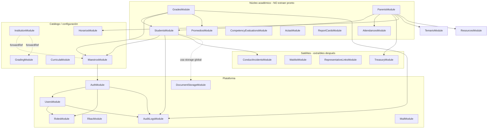
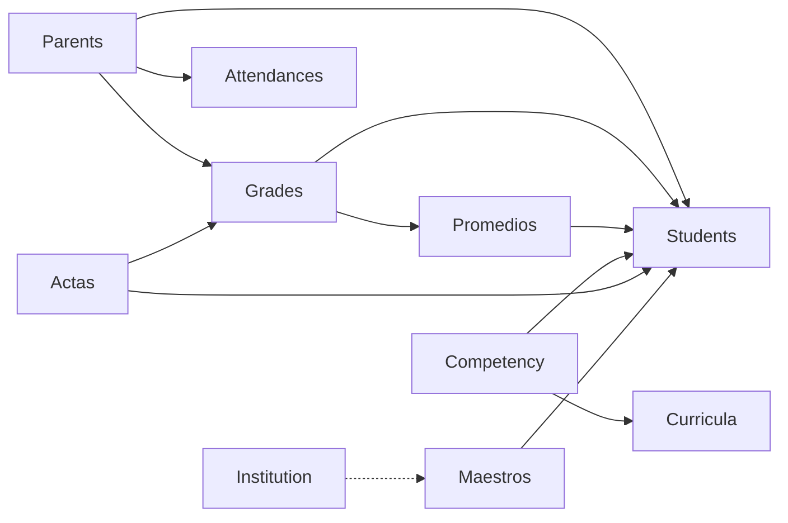

# Mapa de dependencias entre módulos

> Generado a partir del código en `src/`. Para regenerar el JSON crudo:
> `node scripts/analyze-module-deps.mjs > scripts/module-deps.json`

## Resumen ejecutivo

| Métrica | Valor |
|---------|-------|
| Módulos NestJS | 36 |
| Dependencias explícitas entre módulos | 38 |
| Referencias cruzadas a entidades de otro módulo | 39 |
| Ciclos (`forwardRef`) | 1 par: `InstitutionModule` ↔ `MaestrosModule` / `GradingModule` |
| Candidato #1 a microservicio | **Documentos estudiantiles** (bajo acoplamiento, storage ya abstraído) |
| Módulo más acoplado | **`ParentsModule`** (11 imports de módulos) |
| Hub central | **`MaestrosModule`** (referenciado por 10+ módulos) |

**Conclusión:** el backend es un **monolito modular** bien organizado por carpetas, pero con acoplamiento fuerte en el núcleo académico (`students` ↔ `grades` ↔ `maestros` ↔ `parents`). Documentos es el dominio más aislado y el primero que conviene extraer *cuando* haga falta.

---

## Clusters de dominio



---

## Grafo completo: imports entre módulos

Solo aristas donde un `.module.ts` importa otro `.module.ts`.

| Desde | Importa |
|-------|---------|
| **ActasModule** | StudentsModule, MaestrosModule |
| **AttendancesModule** | StudentsModule, MaestrosModule, MailModule |
| **AuthModule** | UsersModule, RolesModule, AuditLogsModule |
| **CompetencyEvaluationsModule** | StudentsModule, MaestrosModule, CurriculaModule |
| **ContinuityEnrollmentModule** | AuthModule, MaestrosModule, GradingModule |
| **CurriculaModule** | MaestrosModule |
| **DashboardModule** | AuthModule, TreasuryModule, MaestrosModule |
| **GradesModule** | StudentsModule, MaestrosModule, GradingModule, PromediosModule, AuditLogsModule |
| **GradingModule** | AuthModule |
| **HorariosModule** | CurriculaModule, AuthModule |
| **InstitutionModule** | GradingModule *(forwardRef)*, MaestrosModule *(forwardRef)* |
| **MaestrosModule** | AuthModule |
| **ParentsModule** | StudentsModule, AttendancesModule, EventsModule, HorariosModule, TreasuryModule, GradingModule, PromediosModule, TemarioModule, ResourcesModule, ConductIncidentsModule, TasksModule |
| **PromediosModule** | StudentsModule, MaestrosModule, GradingModule |
| **RbacModule** | UsersModule |
| **ReportCardsModule** | CompetencyEvaluationsModule, InstitutionModule |
| **RepresentativeLinksModule** | AuditLogsModule |
| **ResourcesModule** | TasksModule |
| **RolesModule** | AuditLogsModule |
| **StudentsModule** | MaestrosModule, ConductIncidentsModule, AuditLogsModule |
| **TemarioModule** | AuthModule |
| **TreasuryModule** | AuthModule |
| **UsersModule** | RolesModule, AuditLogsModule |
| **WaitlistModule** | StudentsModule, MaestrosModule |

### Módulos sin dependencias de otros dominios (aislados)

`AnnouncementsModule`, `CoursesModule`, `EventsModule`, `MailModule`, `SchedulesModule`, `DocumentStorageModule`, `ConductIncidentsModule` *(solo entidad Student)*.

---

## Referencias cruzadas a entidades (anti-patrón para microservicios)

Cuando un módulo registra en TypeORM una entidad que **pertenece a otro dominio**, comparte la misma BD y acopla esquemas.

| Módulo consumidor | Entidades ajenas que registra |
|-------------------|-------------------------------|
| **StudentsModule** | `Attendance`, `Grade`, `Schedule`, `HorarioBlock`, `Docente`, `CurriculumArea`, `CurriculumSubject`, `User`, `Institution` |
| **MaestrosModule** | `Student`, `Institution`, `Sede`, `User`, `Evento`, entidades de `curricula` y `horarios` |
| **ParentsModule** | `Grade`, `Docente` |
| **GradesModule** | `EvaluationActa`, `Institution` |
| **DashboardModule** | `Student`, `Docente`, `Attendance`, `StudentCharge` |
| **TasksModule** ↔ **ResourcesModule** | Referencia circular de entidades `Task` / `TeacherResource` |

**StudentsModule** es el más problemático: mezcla expediente, documentos, notas, asistencia y currículo en un solo `TypeOrmModule.forFeature([...])`.

---

## Inyección de servicios entre módulos

Dependencias runtime (constructor `private readonly XxxService`):

| Servicio | Depende de |
|----------|------------|
| **ParentsService** | Students, Attendances, Tasks, Temario, Resources, Events, Horarios, Treasury, GradingConfig, Promedios, Mail, ConductIncidents *(12 servicios)* |
| **GradesService** | Students, FormulasEvaluacion, CursosMaestros, PeriodosAcademicos, GradingConfig, Promedios, GradeChangeAudit |
| **StudentsService** | Salones, PeriodosAcademicos, ConductIncidents, StudentChangeAudit, **StudentDocuments** |
| **StudentDocumentsService** | **DocumentStorage**, **AuditLogger** |
| **AttendancesService** | Students, Feriados, PeriodosAcademicos, Mail |
| **ActasService** | Students, FormulasEvaluacion, PeriodosAcademicos, CursosMaestros |

---

## Análisis: extracción de `documents-service`

### Estado actual del dominio documentos

| Componente | Ubicación | Notas |
|------------|-----------|-------|
| Servicio principal | `student-documents.service.ts` | Upload, versiones, descarga, auditoría local |
| CRUD metadatos | `students.service.ts` | `addDocument`, `updateDocument`, `removeDocument`, `syncRequisitos`, `replaceDocumentos` |
| Controlador | `students.controller.ts` | Rutas mezcladas bajo `/students/:id/documents/*` |
| Entidades | `student-document*.entity.ts` | 3 tablas + FK lógica a `students` |
| Storage | `src/storage/*` | Abstracción local/MinIO — **portable** |
| Permisos | `estudiantes.documentos` | RBAC compartido |
| OpenAPI | `docs/openapi/student-documents.openapi.yaml` | Contrato ya definido |

### Dependencias de `StudentDocumentsService`

```
StudentDocumentsService
├── DocumentStorageService     ✅ ya desacoplado (MinIO)
├── AuditLoggerService         ⚠️  escribe en audit_logs global
├── Repository<Student>        ⚠️  solo valida que exista el estudiante
├── Repository<Institution>    ⚠️  solo para GET /documents/context
├── Repository<StudentDocument>
├── Repository<StudentDocumentVersion>
└── Repository<StudentDocumentAuditLog>
```

**Ningún otro módulo** importa `StudentDocumentsService` excepto `StudentsModule` internamente.

### Acoplamientos a eliminar (orden recomendado)

| # | Acoplamiento | Severidad | Acción concreta |
|---|--------------|-----------|-----------------|
| 1 | Rutas en `StudentsController` | Media | Crear `StudentDocumentsModule` + `StudentDocumentsController` con prefijo `/students` o `/documents` |
| 2 | CRUD en `StudentsService` | Alta | Mover `addDocument`, `updateDocument`, `removeDocument`, `syncRequisitos`, `replaceDocumentos` al servicio de documentos |
| 3 | `StudentsService.findStudentDocumentsMatricula` → `getActiveFile()` | Media | El monolito llama al microservicio vía HTTP/gRPC, o el frontend pide archivos en un segundo request |
| 4 | Validación `studentRepo.findOne` | Baja | Endpoint interno `GET /students/:id/exists` en core, o JWT con claim `studentId` + cache |
| 5 | `Institution` en `getContext()` | Baja | Duplicar snapshot de institución en documents-service o endpoint `GET /institution/context` en core |
| 6 | Doble auditoría (`student_document_audit_logs` + `audit_logs`) | Media | Publicar evento `DocumentUploaded` → audit-service consume async |
| 7 | Campo legacy `student_documents.imagenUrl` | Baja | Mantener sincronizado vía evento o deprecar cuando el frontend no use base64 |
| 8 | Misma BD PostgreSQL | Alta *(infra)* | Schema `documents` dedicado como paso intermedio; BD separada al extraer |
| 9 | Auth/RBAC compartido | Media | JWT firmado por auth-service; documents-service valida permiso `estudiantes.documentos` localmente |
| 10 | Seed en `database-seed.service` | Baja | Mover seed documental al nuevo servicio |

### Lo que **no** hay que tocar para el primer corte

- `GradesModule`, `ParentsModule`, `MaestrosModule` — no dependen de documentos
- Frontend ya consume REST multipart — solo cambiaría la URL base si hay gateway
- MinIO — ya compartido como infraestructura

### Contrato objetivo del microservicio

```
documents-service  (puerto ej. 3002)
├── GET  /api/v1/documents/context
├── GET  /api/v1/students/:studentId/documents
├── POST /api/v1/students/:studentId/documents/sync-requisitos
├── POST /api/v1/students/:studentId/documents
├── POST /api/v1/students/:studentId/documents/:docId/upload
├── GET  /api/v1/students/:studentId/documents/:docId/versions
├── GET  /api/v1/students/:studentId/documents/:docId/versions/:versionId/download
├── PATCH /api/v1/students/:studentId/documents/:docId
├── DELETE /api/v1/students/:studentId/documents/:docId
└── GET  /api/v1/students/:studentId/documents/audit

core-api (monolito restante)
└── Proxy opcional en gateway, o el frontend llama directo con mismo JWT
```

### Esfuerzo estimado

| Fase | Trabajo | Tiempo orientativo |
|------|---------|-------------------|
| **A. Refactor interno** (sin microservicio) | Extraer `StudentDocumentsModule`, mover CRUD, desacoplar `StudentsService` | 2–3 días |
| **B. Schema PostgreSQL `documents`** | Migrar tablas a schema dedicado | 0.5 día |
| **C. Repo/servicio separado** | Copiar módulo + storage + auth guard | 2–3 días |
| **D. Gateway + observabilidad** | Traefik/nginx, healthchecks, logs correlacionados | 2–5 días |

**Recomendación:** hacer **Fase A ahora** (mejora el monolito y no cuesta operación). Fases B–D solo cuando haya segundo equipo o requisito de aislamiento.

---

## Hotspots del monolito (no extraer)

Estos módulos deben permanecer juntos hasta nuevo aviso:



**ParentsModule** es un **BFF natural** para el portal de apoderados: agrega 12 servicios. Si algún día se extrae, sería como API de composición, no como dominio.

---

## Plan de acción priorizado

### Corto plazo (monolito más limpio)

1. [ ] Crear `StudentDocumentsModule` separado de `StudentsModule`
2. [ ] Mover CRUD documental de `StudentsService` → `StudentDocumentsService`
3. [ ] Sacar rutas documentales de `StudentsController` → `StudentDocumentsController`
4. [ ] Reducir `TypeOrmModule.forFeature` de `StudentsModule` (quitar entidades ajenas gradualmente)
5. [ ] Resolver ciclo `InstitutionModule` ↔ `MaestrosModule` con eventos o servicio de aplicación

### Mediano plazo (pre-microservicio)

6. [ ] Schema PostgreSQL `documents`
7. [ ] Eventos internos: `DocumentUploaded`, `DocumentDeleted` → desacoplar auditoría global
8. [ ] API de composición en frontend o BFF para matrícula + archivos activos

### Largo plazo (microservicios)

9. [ ] Extraer `documents-service` (primer candidato)
10. [ ] Extraer `mail-notifications-service`
11. [ ] Extraer `report-cards-pdf-worker`
12. [ ] Mantener core académico unificado

---

## Módulos por facilidad de extracción

| Prioridad | Módulo | Acoplamiento | Infra extra |
|-----------|--------|--------------|-------------|
| 🟢 1 | Documentos + Storage | Bajo | MinIO (ya existe) |
| 🟢 2 | Mail / notificaciones | Bajo | Cola SMTP |
| 🟡 3 | Audit logs | Medio | BD append-only |
| 🟡 4 | Representative links | Medio | Referencia Student |
| 🟡 5 | Treasury | Medio | Referencia Student |
| 🟡 6 | Report cards PDF | Medio | CPU / cola |
| 🔴 7 | Students + Grades + Parents | Muy alto | — |
| 🔴 8 | Maestros + Institution + Curricula | Muy alto | Ciclo forwardRef |
